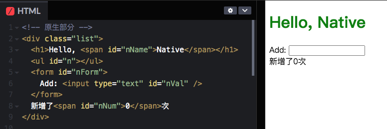
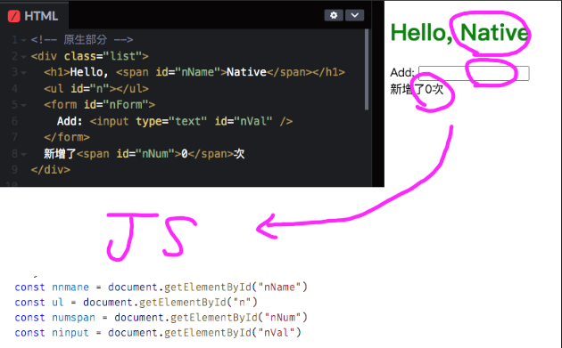
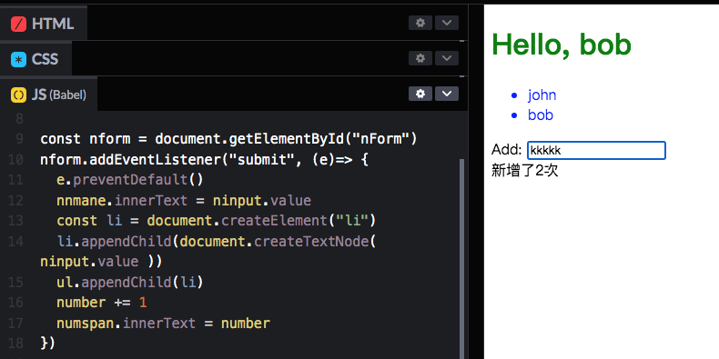
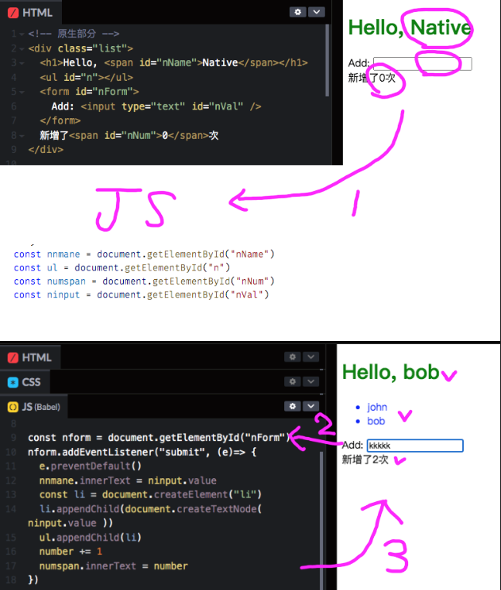

# React 解決了什麼問題

> 說明前端框架到底解決了原生 DOM/JS 開發的什麼問題，閱讀時間 15 分鐘

## 從一個例子開始講起 [代碼範例](https://codepen.io/JohnKeng/pen/YzraJKz)

在 html 新增如下代碼
```html
<!-- 原生部分 -->
<div class="list">
  <h1>Hello, <span id="nName">Native</span></h1>
  <ul id="n"></ul>
  <form id="nForm">
    Add: <input type="text" id="nVal" />
  </form>
  新增了<span id="nNum">0</span>次
</div>
```


頁面上主要有一行 h1 標題、一個 ul 列表紀錄更新內容、與一個 span 紀錄更新次數。

## 需求是使用者在 input 中輸入文字並更新到頁面中

1, 首先我們需要先從取出頁面中會隨著更新而改變的元素
```js
const nnmane = document.getElementById("nName")
const ul = document.getElementById("n")
const numspan = document.getElementById("nNum")
const ninput = document.getElementById("nVal")
```


2, 從頁面中取出改變次數的"數字"並定義一個變數紀錄之
```js
let number = parseInt(nNum.innerText, 10)
```

3, 監聽 form submit 並執行頁面變化

```js
const nform = document.getElementById("nForm")
nform.addEventListener("submit", (e)=> {
  e.preventDefault()
  nnmane.innerText = ninput.value
  const li = document.createElement("li")
  li.appendChild(document.createTextNode( ninput.value ))
  ul.appendChild(li)
  number += 1
  numspan.innerText = number
})
```



## 缺點

傳統的 Js 寫法會發現至少永遠需要關注兩個地方：1 頁面 、2 JS代碼。

首先要先將頁面中需要關注的 dom 元素抽象到 JS 代碼中。寫好變數、監聽、互動等邏輯後再更新至頁面。

且從 JS 代碼中不容易一眼就看清楚整個頁面邏輯是什麼。尤其是監聽 form 變化那邊，既有取頁面資料、又有更新頁面邏輯。當架構越來越大時這是非常難維護的。



# React 作法

react 完善了一種模式叫做
> User Interface as a function of data


首先最大的改變就是，工程師只要在意 JS 怎麼寫就可以，不需要關注兩個地方。

上面的範例，用 React 簡易實現如下
```js
<!-- React  -->
class List extends React.Component {
  constructor(props) {
    super(props);
    this.state = {value: this.props.name, number: 0};
    this.handleSubmit = this.handleSubmit.bind(this);
  }
   handleSubmit(e) {
    e.preventDefault()
    const li = document.createElement("li")
    li.appendChild(document.createTextNode( rVal.value ))
    r.appendChild(li)
     
    this.setState({value: rVal.value, number: this.state.number + 1 })
  }
  render() {
    return (
      <div className="list">
        <h1>List for {this.state.value}</h1>
        <ul id="r"></ul>
        <form onSubmit={this.handleSubmit}>
          Name: <input type="text" id="rVal" />
        </form>
        新增了<span>{this.state.number}</span>次
      </div>
    )
  }
}

ReactDOM.render(<List name="React" />, document.getElementById("root"))
```

### 對比原生 DOM/JS 寫法的難點

原生 dom 及從屬關係（同時是傳遞關係）是通過 html 生成的，當把 Component 抽象為 js 時，要能實現子組件的創建、銷毀、data 傳遞、render、事件監聽（不一定是dom事件）會非常麻煩且代碼難以維護。


### 由此可以發現使用框架有如下好處

1, 使用 Declarative 描述組件並自動生成 dom

2, Component 方式管理 UI，自然地寫出模組化、高維護性、可重複利用的 UI

3, 單向資料流讓 data 是穩定的、可預測的

4, 各種預設事件監聽方法、頁面優化方法、強大的社群資源等 ...

這套機制才是前端框架真正替工程師省力的"髒活"，唯有如此，才有組件化開發、數據驅動...等概念可談。
